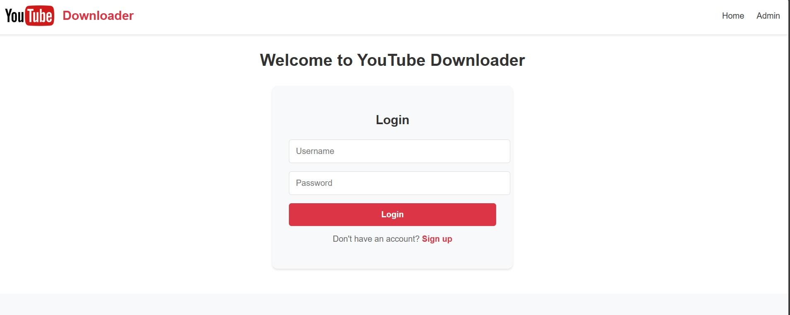
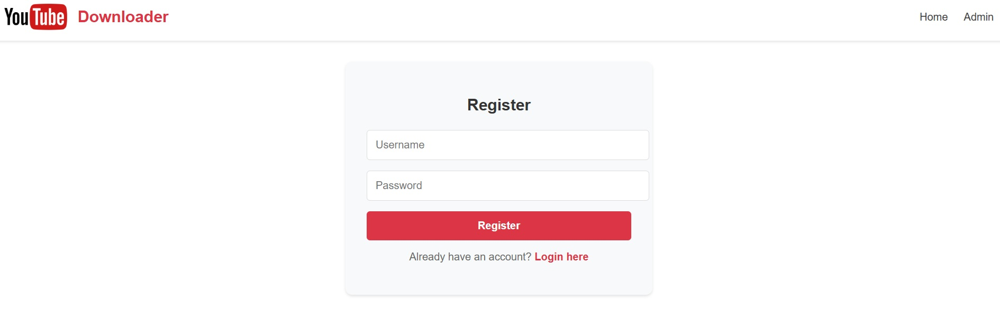
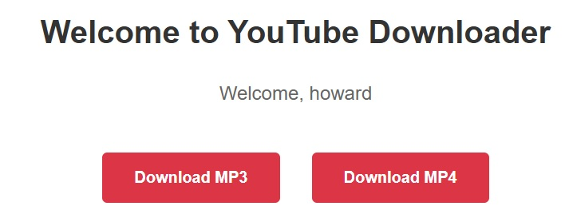
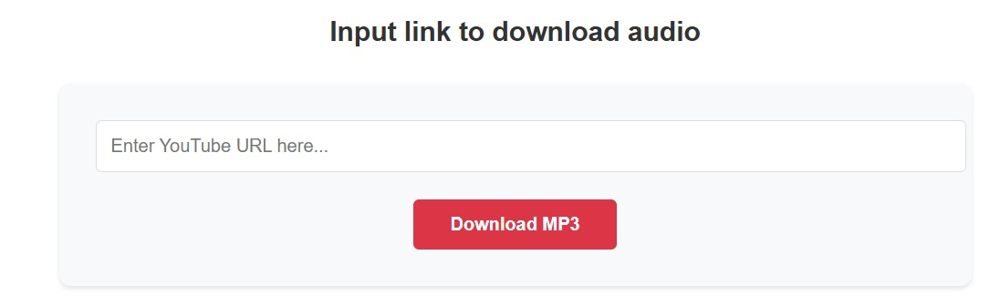
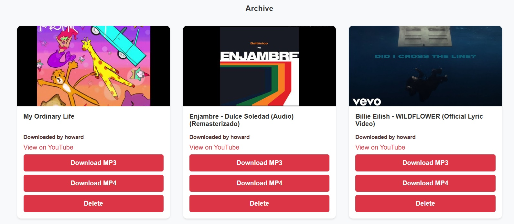

# YouTube Downloader

A Django-based web application that enables users to download YouTube videos and audio files, track their download history, and securely manage user authentication.

## Motivation

- Provide a convenient and ad-free way to download YouTube videos and music.
- Avoid malicious and sketchy ads.

## Features

- Download YouTube videos as MP3
- User authentication (Login/Register)
- Track and display each user's download history

## Installation

```bash
git clone https://github.com/chenghoward2003/YoutubeDownloader.git

cd repo

pip install -r requirements.txt
```

## Usage
```bash
python manage.py runserver
```

## Appearance

**Login Page**  


**Register Page**  


**Home Page**  


**Download as MP3**  


**Download History**  
